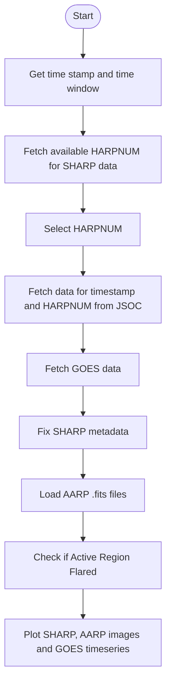

#  SHARP, AARP, and GOES Data Visualiser for Solar Analysis

## Description

The goal of this project is to help visualise solar data products created using observations by the SDO (Solar Dynamics Observatory) and the GOES (Geostationary Operational Environmental Satellite) satellites.
The data products are SHARP (Solar Active Region Patches), AARP (AIA Active Region Patches), and GOES (Geostationary Operational Environmental Satellite). The user can select which of these products they would like to be displayed.

## Installation

1. ### Clone the repository:
   ```bash
   git clone https://github.com/AryanVainala/Intership_Aryan_AstroML.git
   ```
2. **Navigate to the project directory:**
   ```bash
   cd Internship_Aryan_AstroML
   ```
3. **Install the required packages:**
    ```bash
    pip install -r requirements.txt
    ```

## Usage
Once you have navigated to the project directory run
```bash
python .\solar_main.py
```
in your terminal or IDE.

The steps involved in the code are as follows:

1. **Get timestamp and time window:** The user provides a specific timestamp and a time window for the  data.
2. **Fetch available HARPNUM for SHARP data:** Retrieve the available HMI Active Region Patches (HARPNUM) for the specified timestamp.
3. **Select HARPNUM:** User selects a HARPNUM for further analysis.
4. **Fetch data from JSOC:** Download SHARP and LOS magnetogram data for the given timestamp and HARPNUM from the Joint Science Operations Center (JSOC).
5. **Fetch GOES data:** Retrieve GOES X-ray flux data for the specified time window.
6. **Fix SHARP metadata:** Adjust SHARP metadata as it does not adhere to FITS convention.
7. **Load AARP .fits files:** Load AIA Active Region Patches (AARP) FITS files from 'AARP fits file' folder for detailed analysis of active regions.
8. **Check if Active Region Flared:** Determine if the active region experienced a flare during the specified time window.
9. **Plot SHARP, AARP images, and GOES time series:** Generate plots of SHARP and AARP images along with the GOES time series data for visual analysis.

The project extensively uses the Fido search functionality from the Sunpy module for acquiring solar data. More details can be found here[!https://docs.sunpy.org/en/stable/tutorial/acquiring_data/index.html#searching-for-data].

### Data Sources
- **AARP:** Multi-wavelength FITS files from the Atmospheric Imaging Assembly (AIA) on the Solar Dynamics Observatory (SDO). [[1]](#1)
- **SHARP:** HMI Active Region Patches from the Helioseismic and Magnetic Imager (HMI) on the SDO, providing vector magnetic field maps.[[2]](#2)
- **GOES:** Time series data of solar X-ray flux from the Geostationary Operational Environmental Satellite (GOES), used for monitoring solar flare activity.

### Examples
#### Plotting the GOES time series
In order to plot the goes time series open solar_main.py in the project directory. Then set the `sharp` and `aarp` to `False`. 

```bash
from solar_plotter import SolarPlotter

if __name__ == "__main__":
    plotter = SolarPlotter(sharp=False, aarp=False)
    plotter.plot_data()
```
You will then be prompted to input a timestamp from the various given formats and a time window in minutes. In this example the timestamp chosen was `2011-05-28 15:48:00` and the time window was 30 minutes.

After this the time series should display like this:

#### Plotting SHARP magnetogram, AARP images and GOES timeseries
In order to plot all data products open solar_main.py in the project directory. This time set `sharp` and `aarp` to `True`.

You will be prompted to enter a timestamp and a time window, the GOES time series for the selected time range will be downloaded. Next, active regions in the given time range will be retrieved and you will be required to enter the HARPNUM. Then you will have to enter an email which you must register[!http://jsoc.stanford.edu/ajax/register_email.html] with JSOC in order to download the data. Please note the project cannot download AARP files so they must be dowloaded manually from here[!https://umbra.nascom.nasa.gov/contributed/AIA_AARPS/] and put into the aarp_fits_file folder.

In our example we use the same timestamp as above and the SHARP and AARP data are for HAPRNUM 625. Here is the plot:

## References
1. <a id="1">[1]</a>
K. Dissauer, K. D. Leka, and E. L. Wagner, “Properties of Flare-imminent versus Flare-quiet Active Regions from the Chromosphere through the Corona. I. Introduction of the AIA Active Region Patches (AARPs),” Astrophysical Journal/˜the œAstrophysical Journal, vol. 942, no. 2, p. 83, Jan. 2023, doi: 10.3847/1538-4357/ac9c06.
2. <a id="2">[2]</a>
K. Dissauer, K. D. Leka, and E. L. Wagner, “Properties of Flare-imminent versus Flare-quiet Active Regions from the Chromosphere through the Corona. I. Introduction of the AIA Active Region Patches (AARPs),” Astrophysical Journal/the Astrophysical Journal, vol. 942, no. 2, p. 83, Jan. 2023, doi: 10.3847/1538-4357/ac9c06.
3. <a id="3">[3]</a>
“GOES X-Ray Flux | NOAA / NWS Space Weather Prediction Center.” https://www.swpc.noaa.gov/products/goes-x-ray-flux