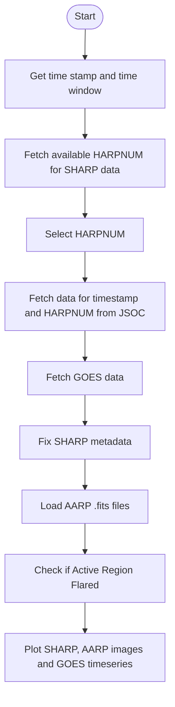

# Assignment 2: Integration and Visualization of SHARP, AARP, and GOES Data for Solar Analysis

## Description

This project involves the integration and visualisation of data from three different solar observation sources: SHARP (Solar Active Region Patches), AARP (Active Region Patches), and GOES (Geostationary Operational Environmental Satellite). The code fetches data based on a specified timestamp which can return multiple HARPNUM (HMI Active Region Patch Number) regions and time window, processes the data to fix any metadata issues, and then displays the data in a combined plot to allow for comprehensive solar analysis.

The steps involved in the code are as follows:

